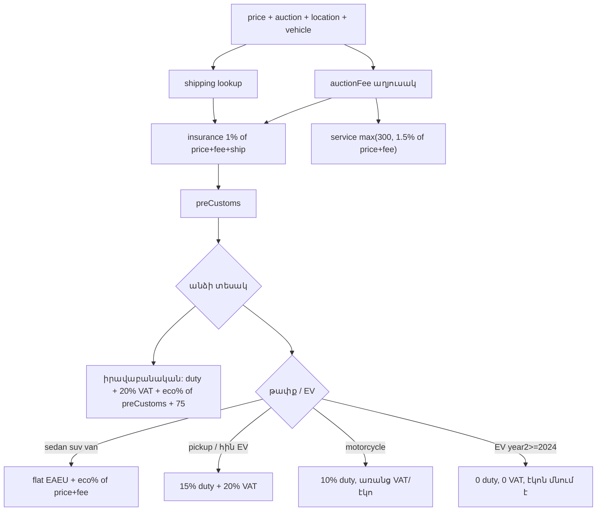

# CarMark / IAA.am հաշվիչի logic

Աղբյուր՝ [https://www.iaa.am/calculators](https://www.iaa.am/calculators)  
Ուսումնասիրված է՝ 2026-08-18

Սա հանրային էջի և `POST /calculator-store-new` պատասխանների վերականգնված մոդել է, ոչ պաշտոնական ներքին սպեցիֆիկացիա։ Վերջնական գումարները կայքում կարող են փոխվել փոխարժեքով, սակագնով կամ պատվերի հաստատման ժամանակ։

---

## 1. Ինչպես է աշխատում

Frontend-ը (`CalculatorComponent.vue`) **չի հաշվում** մաքսը։ Այն միայն հավաքում է ձևը և ուղարկում սերվեր։

```text
Vue ձև  →  POST https://www.iaa.am/calculator-store-new  →  JSON արդյունք
```

Էջի `#calculator-props` JSON-ում գալիս են տեղափոխման սակագները և շարժիչի / տարիքի / թափքի ցուցակները։ Հաշվարկը Laravel backend-ում է։

Արժույթը ամենուր **USD** է, կլորացված ամբողջ դոլարի։

---

## 2. Մուտքեր

| Դաշտ | Իմաստ | Արժեքներ |
|---|---|---|
| `price` | Աճուրդի հայտ (hammer) | USD |
| `auction` | Աճուրդ | `iaai` · `copart` · `etc` (ձեռքով վճար) |
| `auction_fee` | Ձեռքով միջնորդավճար | միայն `etc` |
| `auction_location_id` | Աճուրդի հրապարակ | `price_shippings` աղյուսակի id |
| `auction_location` | Տեղափոխման գին | lookup կամ օգտատիրոջ override |
| `motor` | Շարժիչ | `1` բենզին · `2` դիզել · `3` հիբրիդ · `4` էլեկտրական |
| `year` | Տարիքի խումբ (UI ֆիլտր) | `1` մինչև 3 · `2` 3–5 · `3` 5–7 · `4` 7+ |
| `year2` | Արտադրության տարի | սերվերը տարիքը վերցնում է **այստեղից** |
| `engine_volume` | Ծավալ, սմ³ | EV + motorcycle-ում դաշտը disabled է |
| `auto_type` | Թափք | `sedan` · `suv` · `big_suv` · `van` · `pickup` · `motorcycle` · `ev` · `hybrid` |
| `insurance` | Ապահովագրություն | default `true` |
| `checkbox` | Բարձր անցողականություն | SUV / big SUV, **2026-08-18-ին արդյունքի վրա չի ազդում** |

`year` dropdown-ը միայն սահմանափակում է `year2`-ի ցուցակը (2026-ի համար).

| `year` | Թույլատրելի `year2` |
|---|---|
| 1 | 2023–2026 |
| 2 | 2021–2023 |
| 3 | 2019–2021 |
| 4 | 1950–2019 |

Սերվերը տարիքը հաշվում է `currentYear - year2` բանաձևով։ Օրինակ՝ `year2 = 2023` → 3 տարի → **3–5** խումբ, նույնիսկ եթե UI-ում ընտրված է «մինչև 3»։

---

## 3. Ընդհանուր բանաձև

```text
auctionFee     = IAAI/Copart աղյուսակ(price)   կամ   օգտատիրոջ auction_fee
shipping       = price_shippings[location][auto_type]
insuranceFee   = insurance ? 1% × (price + auctionFee + shipping) : 0
preCustoms     = price + auctionFee + shipping + insuranceFee

առանց մաքսի   = preCustoms
```

`preCustoms`-ը API-ում `total` դաշտն է և այս նախագծում հավասար է «ընդհանուր գին՝ առանց
մաքսազերծման»-ին։

### 3.1 Ծառայության վճար (ֆիրմայի միջնորդավճար)

IAA.am-ը ավելացնում է ծառայության վճար (API-ում `servicePrice`) և UI-ում ցույց է տալիս
`total + servicePrice`։ Այս նախագծում դա «Ֆիրմայի հարկ» տողն է։

```text
companyFee = max(300, ceil(1.5% × (price + auctionFee)))
```

Կլորացումը դեպի վեր է, ամբողջ դոլար։ Բազան միայն հայտն ու աճուրդի վճարն են․
տեղափոխումն ու ապահովագրությունը չեն մտնում։ Վճարը գումարվում է մաքսից առաջ
ընդհանուրին և վերջնական գնին, բայց մաքսատուրքի / ԱԱՀ / էկո բազա չի մտնում։
$52 000-ից բարձր գնի համար առանձին «զանգել» ճյուղ չկա. բանաձևը գործում է ցանկացած գնի վրա։

Ստուգված `servicePrice` (2026-09-23).

| Հայտ | Աճուրդ | Վճար | Ծառայություն |
|---:|---|---:|---:|
| 10 000 | IAAI | 1 225 | 300 |
| 20 000 | IAAI | 1 575 | 324 |
| 20 000 | Copart | 1 469 | 323 |
| 60 000 | IAAI | 3 975 | 960 |

### 3.2 Ապահովագրություն

```text
insuranceFee = 0.01 × (price + auctionFee + shipping)
```

Մտնում է `preCustoms` և իրավաբանական մաքսի / ԱԱՀ / էկո բազա։ **Չի մտնում** ֆիզիկական էկո բազա և ֆիզիկական «մինչև 3 տարի» ad valorem բազա։

### 3.3 Աճուրդի միջնորդավճար

Երկու աճուրդն էլ **աստիճանաձև աղյուսակ** են մինչև $15,000։ Այդ գնից սկսած (ներառյալ $15,000, որտեղ արդյունքը համընկնում է աղյուսակի հետ) գործում է.

```text
iaaiFee   = 0.06 × price + 375
copartFee = 0.06 × price + 269     // նույնը, ինչ IAAI − 106
```

Այս նախագիծը տոկոսային ճյուղը կլորացնում է մոտակա ամբողջ դոլարի։ iaa.am-ի API-ն այստեղ կարող է վերադարձնել ցենտեր (`$15,001` → `1275.06`)։

$15,000-ից ցածր Copart-ը սովորաբար **$106-ով էժան է** IAAI-ից, բացի երկու հարթ միջակայքից.

| Հայտ | Copart | IAAI − 106-ի փոխարեն |
|---|---:|---|
| 8 500 – 9 999 | 1 089 | 1 119 |
| 12 500 – 14 999 | 1 119 | 1 159 |

IAAI-ի $7,991–$7,999 միջակայքում կայքը վերադարձնում է **$360** (2026-09-23, կրկնվող)։ Copart-ը այդ անկումը չի կրկնում և մնում է $1,029։

Ստուգված հատակներ (2026-09-23). Վճարը գործում է այդ գնից մինչև հաջորդ հատակը։

| Հայտից, USD | IAAI | Copart |
|---:|---:|---:|
| 0 | 216 | 110 |
| 100 | 290 | 184 |
| 200 | 325 | 219 |
| 300 | 350 | 244 |
| 350 | 365 | 259 |
| 400 | 390 | 284 |
| 450 | 400 | 294 |
| 500 | 425 | 319 |
| 550 | 435 | 329 |
| 600 | 450 | 344 |
| 700 | 475 | 369 |
| 800 | 495 | 389 |
| 900 | 510 | 404 |
| 1 000 | 550 | 444 |
| 1 200 | 570 | 464 |
| 1 300 | 585 | 479 |
| 1 400 | 600 | 494 |
| 1 500 | 625 | 519 |
| 1 600 | 640 | 534 |
| 1 700 | 660 | 554 |
| 1 800 | 680 | 574 |
| 2 000 | 715 | 609 |
| 2 400 | 750 | 644 |
| 2 500 | 785 | 679 |
| 3 000 | 830 | 724 |
| 3 500 | 880 | 774 |
| 4 000 | 940 | 834 |
| 4 500 | 965 | 859 |
| 5 000 | 990 | 884 |
| 5 500 | 1 015 | 909 |
| 6 000 | 1 060 | 954 |
| 6 500 | 1 080 | 974 |
| 7 000 | 1 115 | 1 009 |
| 7 500 | 1 135 | 1 029 |
| 7 991 – 7 999 | 360 | 1 029 |
| 8 000 | 1 175 | 1 069 |
| 8 500 | 1 225 | 1 089 |
| 10 000 | 1 225 | 1 119 |
| 11 500 | 1 235 | 1 129 |
| 12 000 | 1 250 | 1 144 |
| 12 500 | 1 265 | 1 119 |
| 15 000+ | `6% + 375` | `6% + 269` |

`etc` ռեժիմում վճարը գալիս է `auction_fee` դաշտից։

Սա **CarMark-ի ներքին աղյուսակն** է (buyer + internet + gate + այլ հավելումների փաթեթ), ոչ անպայման IAAI/Copart պաշտոնական invoice-ի ամբողջական կրկնօրինակ։


### 3.4 Տեղափոխում

`src/lib/calculator/data/shipping-locations.json`։ Յուրաքանչյուր հրապարակ ունի 6 գին՝ դեպի **Գյումրի**.

```text
sedan · suv · pickup · motorcycle · big_suv · van
```

**Աղբյուր.** Բազային աղյուսակը CarMark/IAA է։ Որտեղ
`docs/auctionauto-shipping-rates-2024-11-03.md`-ում կա թվային գին՝
`Car→sedan`, `Motorcycle→motorcycle`, իսկ `Pickup`/`SUV`-ը միայն եթե ≥ 1500 USD
(կանադական տեղական/OCR աղմուկը չի վերագրում)։ `Call for price` / դատարկ / `—`
դեպքում մնում է նախորդ գինը։ `big_suv` և `van` MD սյունակ չունեն՝ անփոփոխ։

Օրինակներ (USD, AuctionAuto overlay-ից հետո).

| Հրապարակ | sedan | suv | pickup | motorcycle | big_suv | van |
|---|---:|---:|---:|---:|---:|---:|
| NJ-NORTHERN NEW JERSEY | 2 325 | 2 090 | 2 560 | 2 275 | 2 310 | 2 310 |
| Other (`etc`) | 0 | 0 | 0 | 0 | 0 | 0 |

Թափքը փոխելիս shipping-ը վերցվում է նույն հրապարակի համապատասխան սյունակից։ Օգտատերը կարող է գինը ձեռքով փոխել։

Forsage-ում հաշվարկը չի վերցնում `suv`/`big_suv` սյունակները որպես վերջնական գին․ SUV-ը գնում է սեդանի սակագնով, մեծ SUV-ը՝ սեդան + $300, իսկ `ev` (էլեկտրոմոբիլ) և `hybrid` (հիբրիդ)՝ սեդան + $100։

---

## 4. Փոխարժեք

Մաքսի **եվրոյով** մասը (`€/սմ³`) վերածվում է դոլարի ֆիքսված գործակցով.

```text
EURUSD ≈ 1.1537     (դիտարկված 2026-08-18-ի պատասխաններից)
dutyUsd = euroPerCm3 × engineVolume × 1.1537
```

Նույն օրվա ԿԲ խաչաձև՝ `EUR 422.81 / USD 365.25 ≈ 1.1576`։ CarMark-ը, ըստ երևույթին, պահում է աշխատանքային կուրս, ոչ ամենավերջին ԿԲ տպումը։

Ad valorem (տոկոսը արժեքից) ֆիզիկական «մինչև 3 տարի» դեպքում դիտարկված արդյունավետ գործակիցը **≈ 47.84%** է `(price + auctionFee)`-ից, ինչը համընկնում է.

```text
0.48 × (price + auctionFee) × (1.1537 / CBA_EURUSD)
```

այսինքն 48%-ը հաշվվում է եվրոյով (ԿԲ խաչաձևով), հետո վերադարձվում է իրենց `1.1537` կուրսով։

---

## 5. Իրավաբանական անձ

```text
duty       = տոկոս կամ €/սմ³  (տես աղյուսակը)
vat        = 20% × (preCustoms + duty)     // EV արտոնությամբ՝ 0
eco        = ecoRate × preCustoms
legalTotal = preCustoms + duty + vat + eco
```

> IAA.am-ը այս գումարին ավելացնում է $75 բրոքերական ձևակերպումների տող։
> Այս նախագիծը այդ վճարը չի գանձում, ուստի բանաձևում և արդյունքներում այն չկա։

API դաշտեր՝ `customs_clearance`, `vat`, `environmental`, `tax`, `total_price2`։

### 5.1 Մաքսատուրք

| Տարիք | Ծավալ | Բանաձև |
|---|---|---|
| մինչև 3 | ≤ 2500 սմ³ | `15% × preCustoms` |
| մինչև 3 | ≥ 2999 սմ³ | `12.5% × preCustoms` |
| 3–5 և 5–7 | ≤ 3000 սմ³ | `20% × preCustoms` |
| 3–5 և 5–7 | > 3000 սմ³ | `max(20% × preCustoms, €0.80 × vol × 1.1537)` |
| 7+ | ըստ ծավալի | միայն `€/սմ³ × vol × 1.1537` |

**7+ իրավաբանական `€/սմ³`**

| սմ³ | €/սմ³ |
|---|---:|
| ≤ 1000 | 1.40 |
| 1001–1500 | 1.50 |
| 1501–1800 | 1.60 |
| 1801–3000 | 2.20 |
| > 3000 | 3.20 |

**Մոտոցիկլ**՝ `10% × preCustoms`, էկո = 0։

Բենզին / դիզել / հիբրիդ նույնն են։ Տարբերվում է միայն էլեկտրականը (բաժին 7)։

### 5.2 Բնապահպանական հարկ (իրավաբանական)

Բազա = `preCustoms` (ներառյալ ապահովագրությունը)։

| Տարիք | Տոկոս |
|---|---:|
| մինչև 3 | 2% |
| 3–5 | 4% |
| 5–7 | 6% |
| 7+ | 12% |
| մոտոցիկլ | 0 |

---

## 6. Ֆիզիկական անձ

Երկու ռեժիմ կա։

### 6.A Մարդատար (sedan / suv / big_suv / van / ev / hybrid)

Միասնական դրույքաչափ (duty + ԱԱՀ մեկ գումարով)։ ԱԱՀ-ն UI-ում չի ցուցադրվում։

```text
flatRate   = EAEU ֆիզիկական սակագին (բաժին 6.1)
eco        = ecoRate × (price + auctionFee)    // առանց shipping/insurance
fizTotal   = preCustoms + flatRate + eco
```

API՝ `customs_clearance2` = flat rate, `vat2 = 0`, `environmental2`, `total_price_fiz`։

Էկո տոկոսները նույնն են, ինչ իրավաբանականում (2 / 4 / 6 / 12), բայց բազան **միայն** `price + auctionFee` է։

### 6.B Pickup, մոտոցիկլ, էլեկտրական (առանց արտոնության)

Այստեղ ցուցադրվում են առանձին մաքսատուրք և ԱԱՀ՝ ինչպես իրավաբանականում.

```text
pickup / հին EV:
  duty = 15% × (price + auctionFee)
  vat  = 20% × (price + auctionFee + duty)
  eco  = ecoRate × (price + auctionFee)

motorcycle:
  duty = 10% × (price + auctionFee)
  vat  = 0
  eco  = 0
```

### 6.1 Միասնական դրույքաչափ (մարդատար)

Սա EAEU 2020 ֆիզիկական սակագնի **CarMark իրականացումն** է։ 3 տարուց բարձր խմբերը համընկնում են պաշտոնական `€/սմ³` աղյուսակի հետ։ «Մինչև 3 տարի»-ն պարզեցված է (տես 6.2)։

**3–5 տարի** — միայն `€/սմ³ × vol × 1.1537`

| սմ³ | €/սմ³ |
|---|---:|
| ≤ 1000 | 1.5 |
| 1001–1500 | 1.7 |
| 1501–1800 | 2.5 |
| 1801–2300 | 2.7 |
| 2301–3000 | 3.0 |
| > 3000 | 3.6 |

**5–7 և 7+** — նույն աղյուսակը (EAEU «5 տարուց ավելի»). էկոն է տարբերվում, ոչ flat rate-ը։

| սմ³ | €/սմ³ |
|---|---:|
| ≤ 1000 | 3.0 |
| 1001–1500 | 3.2 |
| 1501–1800 | 3.5 |
| 1801–2300 | 4.8 |
| 2301–3000 | 5.0 |
| > 3000 | 5.7 |

Օրինակ՝ 2000 սմ³, 5+ տարի → `4.8 × 2000 × 1.1537 ≈ $11 075`։

### 6.2 Մինչև 3 տարի (պարզեցված)

```text
flat = max( adValorem, specific )
adValorem ≈ 47.84% × (price + auctionFee)
specific  = euroRate × volume × 1.1537
```

Դիտարկված `euroRate` 2000 սմ³-ի վրա.


| Մոտավոր մաքսային արժեք (`price + fee`) | Կիրառված €/սմ³ | Արդյունք 2000 սմ³ |
|---|---:|---:|
| ≤ ~$9 200 (օր. $8k հայտ) | 2.5 | $5 768 |
| ~$10k–$16k | 3.5 | $8 075 |
| ~$19k–$24k | 5.5 | $12 690 |
| ավելի բարձր | ad valorem հաղթում է | օր. $40k → $20 462 |

Պաշտոնական EAEU «մինչև 3 տարի» աղյուսակը **ծավալով** է, ոչ արժեքով.

| սմ³ | % արժեքից | նվազագույն €/սմ³ |
|---|---:|---:|
| ≤ 1000 | 54% | 2.5 |
| 1001–1800 | 48% | 3.5 |
| 1801–3000 | 48% | 5.0 |
| > 3000 | 48% | 7.0 |

CarMark-ը $10k / 2000–4000 սմ³ կետերում վերցնում է **€3.5**, ոչ պաշտոնական €5 / €7։ ≤1000 սմ³-ում կիրառում է ~48%, ոչ 54%։ Սա գնահատականը **ցածրացնում է** մեծ ծավալի նոր մեքենաների համար։

---

## 7. Էլեկտրական արտոնություն

API դրոշ՝ `electric_exemption_applied`։

Պայման (UI tooltip + ստուգված `year2`).

- շարժիչ = էլեկտրական (`motor = 4`)
- արտադրություն **2023-ի դեկտեմբերի 31-ից հետո** → `year2 ≥ 2024`
- գործում է **2026 փետրվարի 1 – դեկտեմբերի 31**
- 0% մաքսատուրք **և** 0% ԱԱՀ՝ և՛ իրավաբանական, և՛ ֆիզիկական
- էկո հարկը **մնում է**
- կայքը նշում է՝ 0%-ը քվոտայի շրջանակում է, վերջնական որոշումը մաքսայինինն է

`year2 = 2023` EV-ն արտոնություն չի ստանում։ Ֆիզիկականում այն գնում է 6.B ճյուղով (`15% + 20% ԱԱՀ`)։

---

## 8. Ելքային դաշտեր և UI գումարում

| API դաշտ | Իմաստ |
|---|---|
| `price` | հայտ |
| `copart_price` | աճուրդի վճար (անունը մոլորեցնող է՝ օգտագործվում է նաև IAAI-ի համար) |
| `servicePrice` | ծառայության վճար → այս նախագծի `companyFee` |
| `auction_location_price` | shipping |
| `insurance_price` | ապահովագրություն |
| `total` | `preCustoms` |
| `customs_clearance` / `vat` / `environmental` / `tax` | իրավաբանական |
| `total_price2` / `legal_total_value` | իրավաբանական վերջնական |
| `customs_clearance2` / `vat2` / `environmental2` | ֆիզիկական |
| `total_price_fiz` / `individual_total_value` | ֆիզիկական վերջնական |
| `electric_exemption_applied` | EV 0% դրոշ |

UI-ում ավելի էժան սյունակը ստանում է `min-price` շրջանակ։

PDF/հայտ՝ `/form-store/{lang}?type=calculatorNew&entity=legal|individual`։ Հաշվարկին չի մասնակցում։

---

## 9. Աշխատած օրինակ

IAAI, $10 000, NJ Northern, sedan, բենզին, 2000 սմ³, 2025, ապահովագրությամբ.

```text
auctionFee     = 1 225
companyFee     = max(300, ceil(1.5% × 11225)) = 300
shipping       = 2 325   // AuctionAuto overlay
insurance      = 0.01 × (10000 + 1225 + 2325) = 136
preCustoms     = 10000 + 1225 + 2325 + 136 = 13 686
առանց մաքսի   = 13 686 + 300 = 13 986

իրավաբանական
  duty   = 0.15 × 13686 = 2 053
  vat    = 0.20 × (13686 + 2053) = 3 148
  eco    = 0.02 × 13686 = 274
  ընդամենը = 13986 + 2053 + 3148 + 274 = 19 461

ֆիզիկական (մարդատար, մինչև 3)
  flat     = 3.5 × 2000 × 1.1537 ≈ 8 075
  eco      = 0.02 × (10000 + 1225) = 225
  ընդամենը = 13986 + 8075 + 225 = 22 286
```

IAA.am-ի իրավաբանական ընդհանուրը `19 536` է, որովհետև ավելացնում է ևս $75 բրոքերական
ձևակերպում։ Այս նախագիծը այդ $75-ը չի գանձում։ Ֆիզիկական `22 286`-ը համընկնում է։

---

## 10. Ինչը չի ազդում / սահմանափակումներ

- Բենզին, դիզել, հիբրիդ՝ նույն մաքսը (բացի EV ճյուղից)։
- «Բարձր անցողականություն» checkbox-ը 2026-08-18-ին արդյունք չի փոխում։
- `yars2` (5–10 / 10–15 տարի) props-ում կա, UI-ն այն overwrite է անում `yars`-ով։
- Գումարները նախնական են. կայքը ինքն է գրում, որ աճուրդը, լոգիստիկան և մաքսը կարող են ճշգրտվել պատվերի հաստատման ժամանակ։
- «Մինչև 3 տարի» ֆիզիկական սակագինը **ամբողջությամբ չի կրկնում** պաշտոնական EAEU ծավալային աղյուսակը։
- Աճուրդի վճարների աղյուսակը CarMark-ի փաթեթն է, ոչ live IAAI/Copart invoice։
- EURUSD-ը cached/աշխատանքային է, ոչ պարտադիր նույն օրվա ԿԲ։

---

## 11. Հոսքի ամփոփ գծապատկեր



---

## 12. Աղբյուրներ

- Կենդանի էջ և `#calculator-props`՝ [iaa.am/calculators](https://www.iaa.am/calculators)
- Frontend՝ `/build/assets/app-BEITahw4.js` source map → `resources/js/components/CalculatorComponent.vue`
- Հաշվարկ՝ `POST /calculator-store-new` (ստուգված ~150 մուտքային համադրությամբ)
- EAEU 2020 ֆիզիկական սակագների համատեքստ՝ [calculator.uic.am](https://calculator.uic.am/?hl=en), ՀՀ ՊԵԿ բացատրություններ
- ԿԲ կուրսեր 2026-08-18՝ USD 365.25, EUR 422.81
