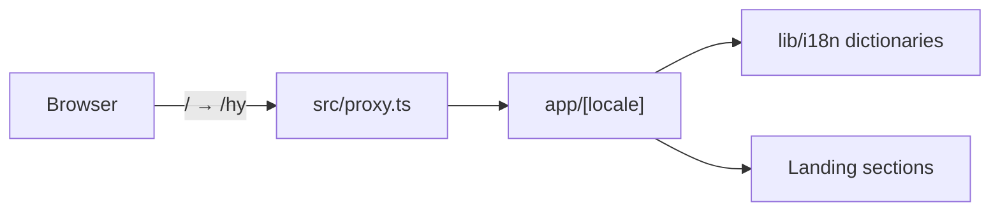
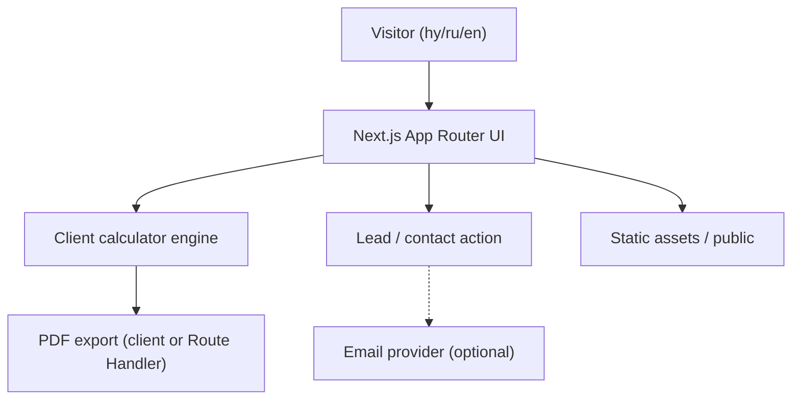

# 03 — Architecture

Audit date: 2026-08-10  
Statuses: current architecture = `CONFIRMED`; target MVP architecture = proposed (not implemented).

---

## Current architecture (code reality)

Single Next.js App Router application with locale segment routing. No separate backend service, no database, no API routes, no auth.

### Request lifecycle (current)

1. Browser requests `/` (or path without locale)
2. `src/proxy.ts` redirects to `/hy...`
3. `[locale]/layout` validates locale, sets `html[lang]`, loads dictionary into `SiteShell`
4. `[locale]/page` renders `LandingPage` with localized copy
5. No mutations / external API calls yet

### Evidence

- `src/app/[locale]/layout.tsx`, `page.tsx`
- `src/lib/i18n/**`
- `src/proxy.ts`
- `.github/workflows/ci.yml`
- No Prisma / NestJS / auth modules

---

## Target MVP architecture (in progress)

Aligned to DOCX: marketing SPA/SSR page + client calculator + optional email for leads + client or server PDF.

### Recommended boundaries (to avoid template overbuild)

| Layer | MVP recommendation | Status |
| --- | --- | --- |
| Frontend | Section components + i18n + calculator UI | `NOT IMPLEMENTED` |
| Calculator domain | Pure functions in `src/lib/calculator` | `NOT IMPLEMENTED` |
| PDF | Prefer client generation first; server only if needed | `NOT IMPLEMENTED` |
| Lead capture | Form → API route → email **or** `mailto:` / external link — **decision required** | `NOT IMPLEMENTED` |
| Database | Not required by DOCX | `NOT FOUND` / avoid unless decision says store leads |
| Auth | Not required by DOCX | `NOT FOUND` |

---

## Frontend architecture (current)

| Concern | Reality |
| --- | --- |
| Framework | Next.js App Router |
| Routing | Single route `/` |
| Layouts | Root layout only |
| Components | None |
| State | None |
| Data fetching | None |
| i18n | None (`lang="en"` hardcoded) |

---

## Backend architecture (current)

`NOT FOUND` — no NestJS, no Route Handlers, no server actions in repo.

`.env.example` implies future DB/JWT usage from **template**, not from Forsage DOCX.

---

## Database architecture (current)

`NOT FOUND`

---

## Authentication flow (current)

`NOT FOUND` — public marketing site per spec.

---

## File / media flow (current)

Only default `public/*.svg` and `favicon.ico`. No upload pipeline.

---

## External services (current code usage)

| Service | In `.env.example` | Used in code |
| --- | --- | --- |
| Neon/DB | Yes | No |
| Upstash Redis | Yes | No |
| Resend | Yes | No |
| Cloudflare R2 | Yes | No |
| Figma token | Yes | No |

---

## Deployment topology (current)

| Item | Status |
| --- | --- |
| Local `pnpm dev` | Available; terminal shows active `pnpm run dev` |
| Vercel project link | `NOT FOUND` in repo configs |
| Docker | `NOT FOUND` |
| CI workflows | `NOT FOUND` under `.github/workflows` |

---

## Architecture preservation rule

Until TECH_CARD / product owner decides otherwise:

- Keep **single Next.js app** (Size A template layout: `src/app`, `components`, `lib`).
- Do **not** introduce NestJS, monorepo, or DB solely because template env mentions them.
- Document any architecture change in `93_CHANGELOG.md` and update this file.
