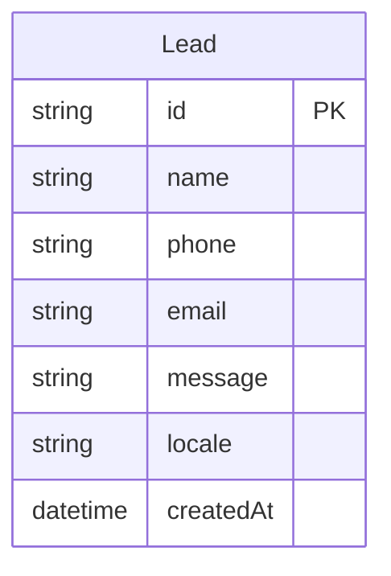

# 22 — Database

Audit date: 2026-08-10

---

## Current schema

**No database.** Status: `NOT FOUND`

| Artifact | Present |
| --- | --- |
| Prisma schema | No |
| Drizzle schema | No |
| SQL migrations | No |
| ORM client | No |
| `DATABASE_URL` usage in code | No |

`.env.example` defines `DATABASE_URL` and pool settings — **template only**, unused.

---

## ER diagram

Not applicable — no entities in code.

If leads are later persisted (decision required), a minimal future model might be:

This model is **proposed**, not implemented — do not treat as real schema.

---

## Integrity notes

| Topic | Status |
| --- | --- |
| Orphan risks | N/A |
| Indexes | N/A |
| Cascades | N/A |
| Soft delete | N/A |

---

## Recommendation

For DOCX MVP, prefer **no DB** until product owner requires lead storage or CMS.
