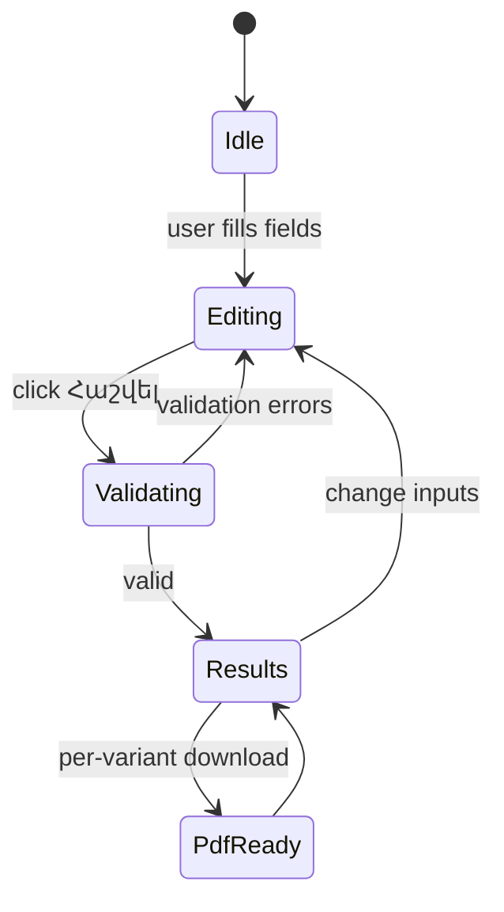

# 30 — Business Logic

Audit date: 2026-08-10  
Note: Logic below is from **specification intent**. Runtime implementation = `NOT IMPLEMENTED`.

---

## Entities (conceptual)

| Entity | Meaning |
| --- | --- |
| Vehicle estimate request | User inputs describing a potential purchase |
| Cost breakdown | Computed line items |
| Cost variant | Legal-person vs physical-person customs totals |
| Lead/application | User request to work with Forsage (ambiguous fields) |

No persisted entities in code.

---

## Calculator workflow (intended)

---

## Calculations (specified outputs, unspecified formulas)

### Inputs (business)

- Auction price (USD)
- Auction (Copart | IAAI)
- Auction fee (USD or auto — both allowed in §5)
- Auction location
- Transport fee
- Engine type
- Age group
- Production year
- Engine volume
- Vehicle type
- Insurance on/off
- Service fee (USD or %)
- Customs-related attributes (implied by age/engine/type)

### Outputs

1. Vehicle price  
2. Auction fee  
3. Service fee  
4. Transport  
5. Insurance  
6. Total before customs  
7. Customs (legal entity)  
8. Customs (physical person)  
9. Final total per variant  

### Critical gap

**Numeric rates, customs tables, and fee formulas are not in the DOCX.**  
Status: `BLOCKED` for accurate CALC implementation until business provides tables.

---

## Process narrative (LAND-004)

Business delivery process for customers (content, not software state machine):

1. Customer states car + budget  
2. Team proposes options  
3. History/damage preliminary review  
4. Bid after confirmation  
5. Payment + transport + customs orchestration  
6. Arrival in Armenia + handover  

---

## Restrictions

- Calculator is **approximate** (spec: մոտավոր հաշվիչ)
- Must not present estimate as final invoice without disclaimer (`NEEDS VERIFICATION` of legal copy)

---

## Automatic actions

| Action | Spec | Code |
| --- | --- | --- |
| Recalculate on submit | Yes | `NOT IMPLEMENTED` |
| Auto auction fee | Allowed option | `NOT IMPLEMENTED` / formula unknown |
| PDF generation | On download click | `NOT IMPLEMENTED` |
| Email on lead submit | Not specified | `UNKNOWN` |
