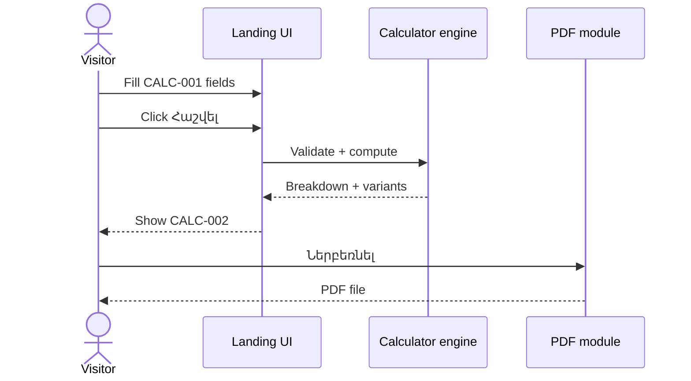

# 31 — User Roles and Flows

Audit date: 2026-08-10

---

## Roles

| Role | In spec | In code |
| --- | --- | --- |
| Visitor | Yes | Implicit (public page) |
| Authenticated user | No | `NOT FOUND` |
| Admin | No | `NOT FOUND` |

---

## Flow A — Browse landing (intended)

```text
Entry: open /
→ Action: scroll sections (hero → about → services → process → calc → why us → form → footer)
→ Validation: n/a
→ Backend: none required
→ Database: none
→ Result: understand offer
→ Next: calculator or contact
```

Code reality: only placeholder — flow `NOT IMPLEMENTED`.

---

## Flow B — Estimate cost (intended)



Status: `NOT IMPLEMENTED`

---

## Flow C — Submit application (intended, ambiguous)

```text
Entry: CTA «Լրացնել հայտ» or application section
→ Action: fill lead fields (TBD)
→ Validation: TBD
→ Backend: TBD (email/API)
→ Database: TBD
→ Result: confirmation message
→ Next: company follows up offline
```

Status: `NEEDS VERIFICATION` + `NOT IMPLEMENTED`

---

## Flow D — Switch language (intended)

```text
Entry: footer/header locale control
→ Action: select hy | ru | en
→ Result: UI copy updates; default hy
```

Status: `NOT IMPLEMENTED` (currently English scaffold)
