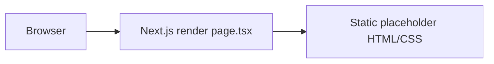

# 32 — Data Flows

Audit date: 2026-08-10

---

## Current data flow



No user data collected. No external fetches. Status: `CONFIRMED`.

---

## Intended calculator data flow

```text
User input (browser state)
  → validation (client)
  → pure compute (lib)
  → results view model
  → optional PDF serialization
```

Persistence: not required by DOCX.

---

## Intended lead data flow (if approved)

```text
User form
  → validate
  → POST /api/leads OR mailto/third-party
  → email to Forsage inbox
  → optional DB insert
  → success UI
```

All steps `NOT IMPLEMENTED` / channel `UNKNOWN`.

---

## Sensitive data considerations

| Data | Sensitivity | Current handling |
| --- | --- | --- |
| Calculator inputs | Low–medium business | Not collected |
| Lead PII (name/phone) | High | Not collected |
| Env secrets | High | Names in `.env.example` only |
